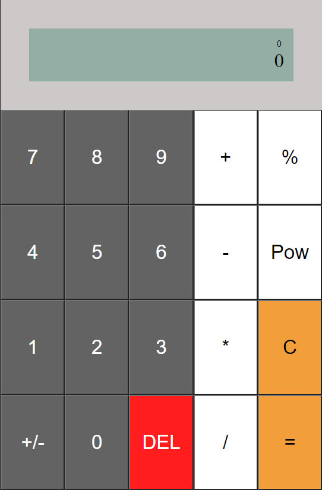

# Web components Calculator

  

<h1 align="center"><a href="https://aaronhernandezperez.github.io/webcomponent-calculator/" target="_blank">Live demo</a></h1>

## Description

This is a simple calculator built with web components as an example of how to use web components.

## How to use

Run index.html in your browser. You can also run it with a local server since it doesn't use any libraries or frameworks.

## Compatibility

Should work with all browsers, customized built-in elements are not compatible with Safari and IE. https://developer.mozilla.org/en-US/docs/Web/API/CustomElementRegistry/define
